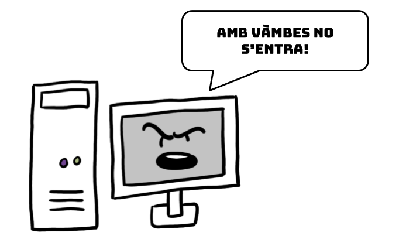
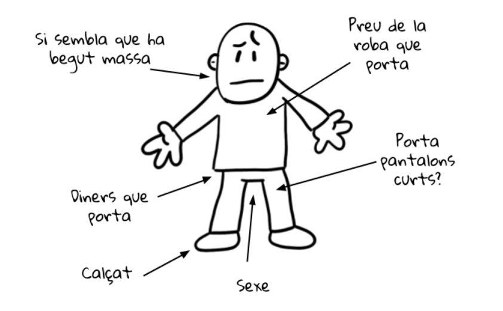

# Desenvolupament del ePorter de Discoteca

Ara que està de moda que tot sigui electrònic i digital, en una discoteca han decidit que els porters de la seva discoteca també han de ser electrònics.

Per això han començat a dissenyar un porter electrònic que decideix si la gent que arriba a la porta pot entrar o no pot entrar.

Abans d’arribar a la porta la gent passa per un escàner que en determina diferents característiques que seran les que el porter farà servir per deixar entrar a la gent o no.

El ePorter permetrà controlar el tipus de clients que entren en la discoteca! El somni humit de qualsevol director!
